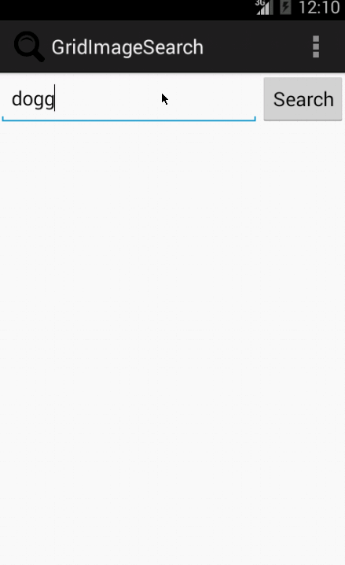

Grid Image Search
====
## Overview
Android project that extends the Google Image Search built during class to allow a user to
modify advanced search options and result pagination.

Time Spent: 5.00 hours

## User Stories

### Mandatory
1. [X] User can enter a search query that will display a grid of image results from the Google Image API.
2. [X] User can click on "settings" which allows selection of advanced search options to filter results
3. [X] User can configure advanced search filters such as:
    * Size (small, medium, large, extra-large)
    * Color filter (black, blue, brown, gray, green, etc...)
    * Type (faces, photo, clip art, line art)
    * Site (espn.com)
4. [X] _Subsequent_ searches will have any filters applied to the search results
5. [X] User can tap on any image in results to see the image full-screen
6. [X] User can scroll down "infinitely" to continue loading more image results (up to 8 pages)

### Optional
7. [ ] Use the ActionBar SearchView or custom layout as the query box instead of an EditText
8. [ ] User can share an image to their friends or email it to themselves
9. [ ] Robust error handling, _check if internet is available_ (implemented!), handle error cases, network failures
10. [ ] Improve the user interface and experiment with image assets and/or styling and coloring
11. [ ] __Bonus__: Replace Filter Settings Activity with a lightweight modal overlay
12. [ ] __Bonus__: User can zoom or pan images displayed in full-screen detail view
13. [ ] __Bonus__: Use the StaggeredGridView to display visually interesting image results
14. [ ] __Bonus__: Allow user to view all comments for an image within a separate screen or a dialog fragment

## Walkthroughs

GIFs created by LiceCap <http://www.cockos.com/licecap/>
